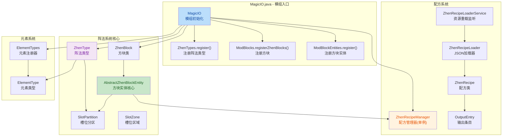
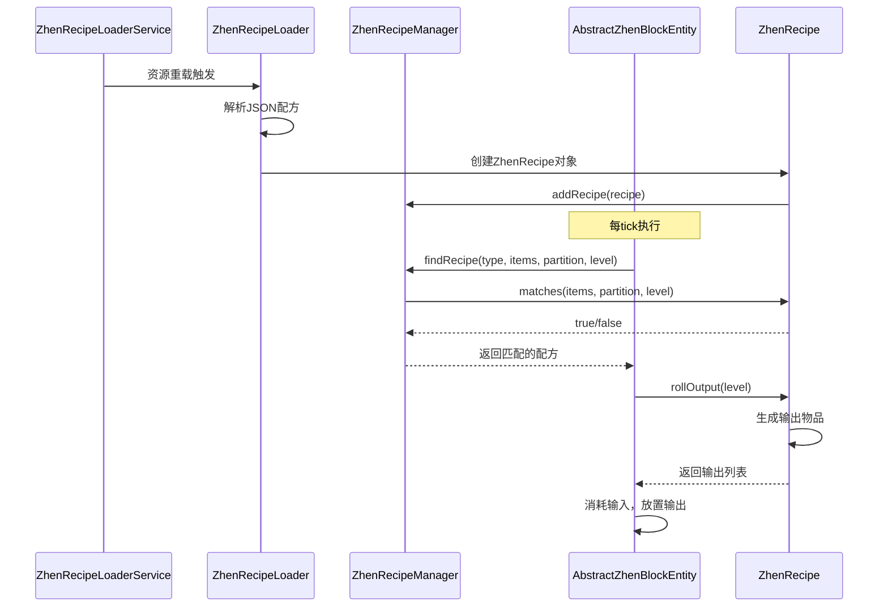

## 0. TODO List

* [ ] 编写材料物品，添加za-27
* [ ] 扩写材料loottable标签
* [ ] 。。。

## 1. 高层摘要（TL;DR）

* **影响范围：** 🟢 **高** - 这是一个全新的Minecraft模组，实现了完整的魔法阵法方块系统
* **核心变更：**
  * ✨ 创建了完整的"Zhen"（阵法）方块系统，支持自定义配方处理
  * 📦 实现了基于JSON的配方加载系统，支持固定物品和战利品表输出
  * 🎨 建立了15种元素类型系统，支持元素继承关系
  * ⚙️ 实现了槽位分区管理，支持输入/输出区域和方向访问控制

---

## 2. 视觉概览（代码与逻辑映射）



### 配方处理流程



---

## 3. 详细变更分析

### 🏗️ 组件一：模组核心架构

**文件：** `MagicIO.java`

**变更说明：**

- 创建了模组主类，定义了MOD_ID为"magic_io"
- 注册了方块、物品、创造模式标签页的延迟注册器
- 初始化了数据组件、阵法类型、方块和方块实体
- 配置了通用配置文件支持

**关键方法：**

- `MagicIO()` - 构造函数，完成所有注册和事件监听器设置
- `commonSetup()` - 通用设置，记录配置信息
- `addCreative()` - 添加物品到创造模式标签页

---

### 🧱 组件二：方块与方块实体系统

#### 2.1 方块类

**文件：** `ZhenBlock.java`, `ModBlocks.java`

**变更说明：**

- `ZhenBlock` - 继承自 `BaseEntityBlock`，是所有阵法方块的基础类
- `ModBlocks` - 根据ZhenType自动注册所有阵法方块和对应的物品

**关键方法：**

- `newBlockEntity()` - 创建方块实体
- `getTicker()` - 返回服务器端tick处理器
- `playerDestroy()` - 方块破坏时掉落容器内物品

#### 2.2 方块实体核心

**文件：** `AbstractZhenBlockEntity.java`

**变更说明：**

- 实现了完整的容器逻辑，包括物品存储、提取、插入
- 支持基于方向的访问控制（上/下/东/西/南/北）
- 实现了配方匹配和处理逻辑
- 支持数据持久化和网络同步

**关键方法：**

| 方法名               | 功能                                   |
| -------------------- | -------------------------------------- |
| `serverTick()`     | 服务器端每tick执行，处理配方匹配和进度 |
| `findRecipe()`     | 查找匹配的配方                         |
| `matches()`        | 检查配方是否匹配当前物品               |
| `rollOutput()`     | 生成输出物品（支持战利品表）           |
| `canFitOutput()`   | 检查输出是否可以放入容器               |
| `produceOutputs()` | 将输出物品放入容器                     |
| `consumeInputs()`  | 消耗输入物品                           |
| `insertItem()`     | 向指定区域插入物品                     |
| `extractItem()`    | 从指定区域提取物品                     |

**面访问控制：**

```java
// 默认配置
UP -> INPUT_ALL (输入区域)
DOWN -> OUTPUT_ALL (输出区域)
```

---

### 📦 组件三：库存与槽位系统

#### 3.1 槽位区域

**文件：** `SlotZone.java`

**变更说明：**

- 定义了三种预定义区域：
  - `INPUT_ALL` - 所有输入槽位
  - `OUTPUT_ALL` - 所有输出槽位
  - `DROP_OUTPUT` - 掉落输出槽位

#### 3.2 槽位分区

**文件：** `SlotPartition.java`

**变更说明：**

- 管理槽位到区域的映射关系
- 验证区域配置的合法性（子区域必须在父区域内）
- 提供槽位查询功能

**关键方法：**

- `getSlots(zone)` - 获取指定区域的所有槽位
- `getZoneByName(name)` - 根据名称获取区域
- `getZoneForSlot(slot)` - 获取槽位所属的所有区域

---

### 🍳 组件四：配方系统

#### 4.1 配方管理器

**文件：** `ZhenRecipeManager.java`

**变更说明：**

- 单例模式管理所有配方
- 提供配方查找、添加、清除功能

**关键方法：**

- `getInstance()` - 获取单例实例
- `addRecipe(recipe)` - 添加配方
- `findRecipe(type, items, partition, level)` - 查找匹配的配方

#### 4.2 配方加载器

**文件：** `ZhenRecipeLoader.java`

**变更说明：**

- 从JSON文件加载配方
- 支持两种输入格式：数组（所有输入）或对象（分区输入）
- 支持两种输出格式：数组（所有输出）或对象（分区输出）
- 支持战利品表验证和加载

**JSON格式示例：**

```json
{
  "type": "small_sift_zhen",
  "inputs": [{"item": "minecraft:gravel"}],
  "outputs": [
    {"item": "minecraft:flint"},
    {"loot_table": "minecraft:gameplay/hero_of_the_village/flint_giver"}
  ],
  "processing_time": 100
}
```

#### 4.3 配方类

**文件：** `ZhenRecipe.java`

**变更说明：**

- 实现了Minecraft的Recipe接口
- 支持分区输入输出
- 支持固定物品和战利品表输出
- 实现配方匹配逻辑

**关键方法：**

- `matches(allItems, partition, level)` - 检查配方是否匹配
- `rollOutput(level)` - 生成输出物品
- `getZoneInputs()` - 获取分区输入
- `getZoneOutputs()` - 获取分区输出

#### 4.4 输出条目

**文件：** `OutputEntry.java`

**变更说明：**

- Record类型，支持两种输出类型：
  - 固定物品（ItemStack）
  - 战利品表（LootTable）
- 提供 `roll()`方法生成实际物品

#### 4.5 配方序列化器

**文件：** `ZhenRecipeSerializer.java`

**变更说明：**

- 实现了Codec和StreamCodec
- 支持配方数据的序列化和反序列化
- 支持网络传输

#### 4.6 配方加载服务

**文件：** `ZhenRecipeLoaderService.java`

**变更说明：**

- 继承自 `SimplePreparableReloadListener`
- 监听资源重载事件
- 自动加载所有包含"sift"的配方文件

**注意：** 当前实现调用了已弃用的 `loadRecipeFromJson(InputStream)`方法，需要修复。

---

### 🌟 组件五：元素系统

#### 5.1 元素类型

**文件：** `ElementType.java`

**变更说明：**

- 定义了元素类型注册表
- 支持元素继承关系（通过parents数组）
- 提供15种预定义元素

#### 5.2 元素注册器

**文件：** `ElementTypes.java`

**变更说明：**

- 注册了15种元素类型：
  - 基础元素：土、水、风、火
  - 复合元素：木、冻、金、雷、秩序、空间、时间、混沌、描述、能量、灵魂、创造
- 支持元素继承关系（例如：木 = 土 + 水）

**元素继承关系表：**

| 元素 | 父元素             |
| ---- | ------------------ |
| 木   | 土 + 水            |
| 冻   | 水 + 风            |
| 金   | 火 + 土            |
| 雷   | 风 + 火            |
| 秩序 | 木 + 金            |
| 空间 | 冻 + 木            |
| 时间 | 金 + 雷            |
| 混沌 | 雷 + 冻            |
| 描述 | 混沌 + 秩序        |
| 能量 | 空间 + 时间        |
| 灵魂 | 雷 + 土 + 能量     |
| 创造 | 描述 + 能量 + 灵魂 |

---

### 🔮 组件六：阵法类型系统

#### 6.1 阵法类型

**文件：** `ZhenType.java`

**变更说明：**

- 定义了阵法类型注册表
- 包含元素类型、类型名称、槽位分区、等级、tick工厂
- 支持自定义tick逻辑

**关键方法：**

- `execute(level, pos, state, blockEntity)` - 执行自定义tick逻辑

#### 6.2 阵法注册器

**文件：** `ZhenTypes.java`

**变更说明：**

- 注册了 `small_sift_zhen`（小型筛阵）
- 配置了2个输入槽位（0-1）和2个输出槽位（2-3）
- 绑定了 `SmallSiftMethod`作为tick处理器

**阵法配置：**

```java
SMALL_SIFT_ZHEN = ZHEN_TYPES.register("small_sift_zhen",
    () -> new ZhenType(
        ElementTypes.EARTH.get(),  // 元素类型：土
        "small_sift_zhen",          // 类型名称
        new SlotPartition(Map.of(   // 槽位分区
            SlotZone.INPUT_ALL, range(0, 1),   // 输入槽位0-1
            SlotZone.OUTPUT_ALL, range(2, 3)   // 输出槽位2-3
        )),
        0,  // 等级
        (method) -> () -> method.small_sift_tick()  // tick工厂
    )
);
```

---

### 🎮 组件七：示例配方

**文件：** `small_sift_zhen_gravel.json`

**变更说明：**

- 示例配方：将砂砾筛分成燧石
- 输入：1个砂砾
- 输出：1个燧石 + 战利品表掉落
- 处理时间：100 ticks

---

### 📝 组件八：数据组件与配置

#### 8.1 数据组件

**文件：** `ModDataComponents.java`

**变更说明：**

- 注册了 `ZHEN_TYPE`数据组件
- 用于在物品上存储阵法类型信息
- 支持持久化和网络同步

#### 8.2 配方类型

**文件：** `ModRecipeManager.java`, `ZhenRecipeType.java`

**变更说明：**

- 注册了 `zhen_block`配方类型
- 实现了配方快速检查机制

---

## 4. 影响与风险评估

### ⚠️ 潜在问题

1. **已弃用方法调用**

   - **位置：** `ZhenRecipeLoaderService.java:44`
   - **问题：** 调用了已弃用的 `loadRecipeFromJson(InputStream)`方法
   - **建议：** 使用 `loadRecipeFromJson(InputStream, MinecraftServer)`方法，传入server参数以启用战利品表验证
2. **未实现的菜单**

   - **位置：** `AbstractZhenBlockEntity.java:605-608`
   - **问题：** `createMenu()`方法抛出 `UnsupportedOperationException`
   - **建议：** 实现GUI菜单以支持玩家交互
3. **空值处理**

   - **位置：** `ZhenTypes.java`, `ElementTypes.java`
   - **问题：** 虽然添加了空值检查，但注册表可能在初始化时为null
   - **建议：** 确保注册表在使用前已完成初始化

### ✅ 测试建议

1. **基础功能测试**

   - [ ] 放置小型筛阵方块
   - [ ] 在输入槽位放入砂砾
   - [ ] 等待100 ticks，检查输出槽位是否有燧石
   - [ ] 测试战利品表掉落是否正常
2. **配方系统测试**

   - [ ] 测试配方加载是否成功
   - [ ] 测试配方匹配逻辑
   - [ ] 测试多个配方同时存在时的优先级
3. **库存系统测试**

   - [ ] 测试物品插入（上方）
   - [ ] 测试物品提取（下方）
   - [ ] 测试物品堆叠逻辑
   - [ ] 测试容器满时的行为
4. **元素系统测试**

   - [ ] 验证所有15种元素类型是否正确注册
   - [ ] 验证元素继承关系是否正确
5. **边界情况测试**

   - [ ] 输入为空时的行为
   - [ ] 输出满时的行为
   - [ ] 配方不存在时的行为
   - [ ] 方块破坏时物品是否正确掉落

### 🔄 破坏性变更

无破坏性变更，这是一个全新的模组项目。

---

## 5. 总结

这是一个设计精良的Minecraft模组项目，实现了完整的魔法阵法方块系统。代码结构清晰，采用了模块化设计，具有良好的扩展性。主要特点包括：

- ✅ 完整的配方系统，支持JSON配置和战利品表
- ✅ 灵活的槽位分区管理
- ✅ 丰富的元素类型系统，支持继承关系
- ✅ 良好的代码组织和注释

需要改进的地方：

- 修复已弃用方法的调用
- 实现GUI菜单
- 添加更多测试用例
- 完善错误处理机制
